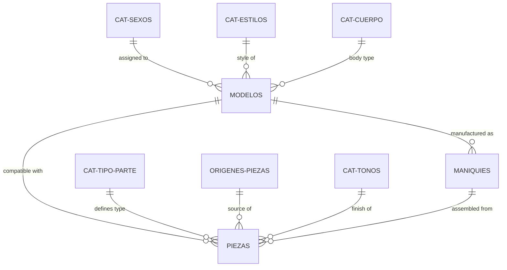

# Analysis of Tecda Maniquí Database Design

Based on the [tecda-maniqui.pdf](file:///home/jmro/Documentos/TECDA/TERCERO/Gestion%20BBDD/tecda-maniqui.pdf), I have designed a relational database schema that optimizes inventory tracking and production assembly.

## 🏗️ Schema Overview

The design is structured into three main layers to ensure data integrity and scalability:

1.  **Catalog Layer**: Standardizes attributes like sexes, styles, body types, part types, and finishes.
2.  **Model Layer**: Defines the blueprint for various mannequin models, including physical specifications and costs.
3.  **Inventory & Production Layer**: Tracks physical units of mannequins (`Maniquies`) and their individual components (`Piezas`).

### 🧬 Entity-Relationship Diagram

## 🛠️ Key Implementation Details

### 1. Assembly & Stock Tracking
The `Piezas` table includes a nullable `maniqui_id` foreign key.
- **Available Part**: `maniqui_id IS NULL`. These parts contribute to the "Component Stock".
- **Assembled Part**: `maniqui_id` matches a record in `Maniquies`. This part is physically attached to a unit.

### 2. Production Capacity
By querying `Piezas` where `maniqui_id IS NULL` and grouping by `modelo_id` and `tipo_parte_id`, the system can calculate how many complete units of a specific `Modelo` can be assembled from current stock.

### 3. Traceability
- **`numero_serie`**: Unique identifier for every assembled mannequin.
- **`serial_parte`**: Unique identifier for every individual part (head, torso, etc.), allowing tracking from source (`Origenes_Piezas`) to final unit.

## 🗃️ Generated Files
- [schema.sql](file:///home/jmro/Documentos/TECDA/TERCERO/Gestion%20BBDD/schema.sql): Complete DDL script with initial data seeding.

> [!TIP]
> Use the `fecha_ensamblaje` in the `Maniquies` table to track production speed and bottlenecks in the factory.
