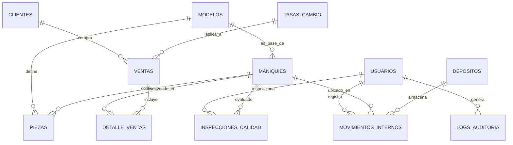

# Análisis del Diseño de Base de Datos - Tecda Maniquí v2.0.0

Este documento detalla la arquitectura evolucionada de la base de datos para la fábrica **Tecda**, diseñada para gestionar el ciclo de vida completo: desde la adquisición de piezas hasta la venta final y auditoría empresarial.

## 🏗️ Estructura del Esquema

El diseño se organiza en cinco capas interconectadas para garantizar integridad, seguridad y analítica avanzada:

1.  **Capa de Catálogos y Maestros**: Estandariza atributos (sexos, estilos, acabados) y orígenes de suministro.
2.  **Capa de Producción e Inventario**: Gestiona los planos técnicos (`Modelos`), las unidades físicas (`Maniquies`) y sus componentes (`Piezas`).
3.  **Capa de Logística y Suministros**: Controla proveedores detallados, depósitos físicos y movimientos internos de stock.
4.  **Capa Comercial y Financiera**: Gestiona clientes, ventas con facturación electrónica (CAE), tasas de cambio (ARS/USD) y márgenes de ganancia.
5.  **Capa de Seguridad y Auditoría**: Implementa RBAC (Control de acceso basado en roles) y registros de auditoría (`Logs`) para cada acción crítica.

### 🧬 Diagrama de Entidad-Relación (Evolucionado)

## 🛠️ Innovaciones Técnicas v2.0.0

### 1. Inteligencia del Motor (Triggers)
*   **Generador de Seriales**: Las piezas reciben un código único (`PZ-TIPO-ORIGEN-NUM`) automáticamente al insertarse.
*   **Validación Anti-Frankenstein**: Un trigger impide físicamente ensamblar piezas de un modelo en un maniquí de modelo diferente, asegurando la integridad técnica del producto.
*   **Auditoría Automática**: Cualquier cambio en precios de venta dispara un log de auditoría sin intervención del programador.

### 2. Capa Analítica y Financiera
*   **Vista de Rentabilidad**: Calcula dinámicamente el margen de ganancia real (`Precio Venta - Suma de Costos de Piezas`) por cada unidad vendida.
*   **Vista de Stock Crítico**: Detecta automáticamente cuellos de botella en la producción cuando un componente específico baja de un umbral mínimo.
*   **Soporte Multimoneda**: Permite operar en Pesos y Dólares mediante una tabla de tasas de cambio vinculada a las ventas.

### 3. Trazabilidad y Calidad (QA)
*   **Inspecciones**: Antes de pasar a estado 'Disponible', cada maniquí requiere un registro de inspección de calidad aprobado por un inspector.
*   **Logística Interna**: Se rastrea el movimiento físico entre la planta, depósitos y showrooms mediante la tabla de `Movimientos_Internos`.

## 🗃️ Scripts de Implementación
El sistema se despliega de forma modular para facilitar auditorías de código:
- **[main_setup.sql](../scripts/main_setup.sql)**: Orquestador de instalación total.
- **Módulos**: Del `step1` (Esquema) al `step7` (Calidad y Configuración).

> [!IMPORTANT]
> La tabla `Configuracion_Sistema` permite ajustar parámetros globales (IVA, Stock Mínimo) de forma externa, desacoplando la lógica de negocio del código fuente.
