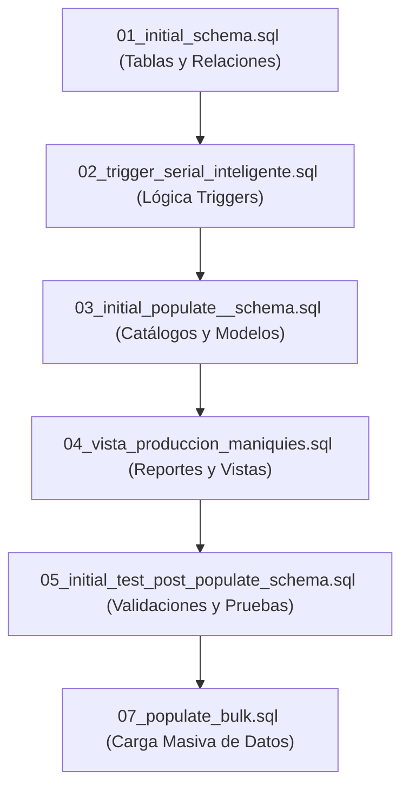

# 🗃️ Guía de Scripts SQL y Secuencia de Despliegue

Este documento describe los archivos SQL provistos en el proyecto **Tecda Maniquí**, detallando su propósito, secuencia de ejecución e integración con la base de datos.

---

## ⚡ 1. Despliegue Rápido (Recomendado)

Si deseas crear la base de datos completa con toda su estructura, triggers, datos de prueba iniciales, vistas y datos masivos en un solo paso, utiliza el script unificado:

👉 **[00_tecda_maniqui_completo.sql](../scripts/00_tecda_maniqui_completo.sql)**

Este archivo consolida todo el código operativo del proyecto de forma ordenada para evitar errores de dependencias de llaves foráneas.

---

## 📂 2. Secuencia de Ejecución Manual (Paso a Paso)

Si prefieres ejecutar el despliegue de manera granular para estudiar o auditar cada componente, debes seguir estrictamente el orden numérico de la carpeta [scripts/](../scripts):

### Detalle de cada script:

1.  ### 📝 [01_initial_schema.sql](../scripts/01_initial_schema.sql)
    *   **Función:** DDL principal. Elimina bases de datos previas, inicializa `tecda_maniqui` y crea las 10 tablas del sistema definiendo índices primarios, llaves foráneas y tipos de datos de alta precisión.
    
2.  ### ⚙️ [02_trigger_serial_inteligente.sql](../scripts/02_trigger_serial_inteligente.sql)
    *   **Función:** Crea e inicializa los disparadores (triggers) en el servidor. Configura el generador atómico de números de serie para piezas e implementa la regla "Anti-Frankenstein" para evitar el ensamblaje de modelos incompatibles.

3.  ### 🌱 [03_initial_populate__schema.sql](../scripts/03_initial_populate__schema.sql)
    *   **Función:** Carga inicial de datos maestros en catálogos y especificaciones de modelos de maniquíes básicos para iniciar la operación.

4.  ### 👁️ [04_vista_produccion_maniquies.sql](../scripts/04_vista_produccion_maniquies.sql)
    *   **Función:** Crea vistas SQL para simplificar el reporte a los analistas de negocio, incluyendo resúmenes de producción, conteo de piezas y estatus de maniquíes ensamblados.

5.  ### 🧪 [05_initial_test_post_populate_schema.sql](../scripts/05_initial_test_post_populate_schema.sql)
    *   **Función:** Suite de pruebas del sistema. Contiene consultas DML para validar el correcto funcionamiento de los triggers (intenta forzar ensamblajes erróneos y comprueba la autogeneración de seriales).

6.  ### 📦 [07_populate_bulk.sql](../scripts/07_populate_bulk.sql)
    *   **Función:** Carga masiva de datos simulados en producción (cientos de piezas y maniquíes) para realizar pruebas de rendimiento, índices y paginación.

---

## 🎓 3. Material y Recursos de Aprendizaje Avanzado

En la carpeta [guia_base_de_datos/](../guia_base_de_datos) cuentas con scripts complementarios para aprender y auditar técnicas de desarrollo avanzadas:

*   **`01_procedimientos_almacenados.sql`**: Automatización de registro de lotes de producción mediante rutinas almacenadas.
*   **`02_transacciones.sql`**: Manejo de transacciones ACID (commit y rollback) para garantizar que los ensamblajes complejos se guarden de forma segura.
*   **`03_indices.sql`**: Optimización del rendimiento de consultas mediante índices secundarios (`B-Tree`).
*   **`04_funciones.sql`**: Funciones escalares del usuario para formatear salidas y reportes.
*   **`05_permisos_usuarios.sql`**: Administración de seguridad de base de datos (roles y privilegios de acceso).
