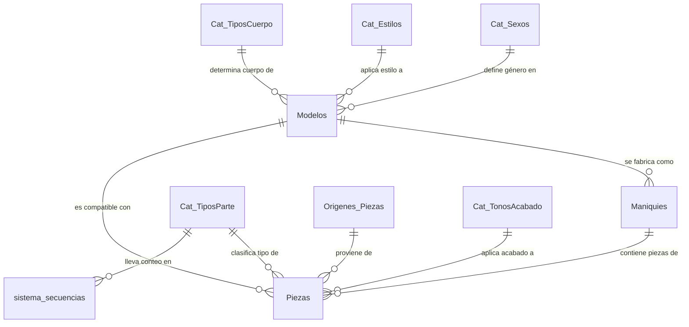

# 🧬 Diseño de Base de Datos y Triggers Inteligentes

Este documento describe la arquitectura de datos para el sistema de producción e inventario de la fábrica **Tecda Maniquí**, así como la automatización integrada en el motor de base de datos mediante triggers avanzados.

---

## 🏗️ 1. Estructura de Capas de Datos

El diseño del esquema está optimizado en formato relacional (3NF) y se organiza en tres capas lógicas para garantizar la escalabilidad y la integridad de referencial:

### A. Capa de Catálogos (Tablas de Soporte)
Estandarizan características fijas de los maniquíes para evitar la inconsistencia de texto libre:
*   `Cat_Sexos`: Sexos para los modelos de maniquíes (Ej: Masculino, Femenino, Uniex).
*   `Cat_Estilos`: Estilo visual del maniquí (Ej: Abstracto, Realista, Silueta).
*   `Cat_TiposCuerpo`: Tipología anatómica (Ej: Entero, Medio Cuerpo, Busto).
*   `Cat_TiposParte`: Clasificación de las piezas individuales (Ej: Cabeza, Torso, Extremidades).
*   `Cat_TonosAcabado`: Combinación única de color y tipo de acabado (Ej: Blanco Mate, Negro Satinado).
*   `Origenes_Piezas`: Indica si la pieza fue fabricada internamente o por un proveedor externo.

### B. Capa de Modelos (Especificaciones)
*   `Modelos`: Representa el diseño técnico. Contiene atributos como altura, ancho, tipo de ojo, boca, pelo, costo estimado, y claves foráneas hacia los catálogos.

### C. Capa de Inventario y Producción (Unidades Físicas)
*   `Maniquies`: Cada unidad física de maniquí ensamblada en fábrica. Identificada de forma única por un número de serie inteligente.
*   `Piezas`: El inventario de partes físicas individuales. 
    > [!TIP]
    > **Control de Stock y Ensamblaje:** Si una pieza tiene `maniqui_id IS NULL`, se encuentra libre en stock. Al ensamblarse, se actualiza `maniqui_id` con el ID del maniquí correspondiente, formando parte de su estructura física.

---

## 🧬 2. Diagrama Entidad-Relación (ERD)



---

## 🛠️ 3. Lógica de Triggers Inteligentes (Nivel Profesional)

Para evitar que las reglas de negocio críticas dependan de la aplicación cliente, la lógica se implementa directamente en el servidor MySQL/MariaDB mediante dos triggers:

### A. Autogenerador de Seriales de Pieza (`tg_generar_serial_pieza`)
*   **Momento:** `BEFORE INSERT ON Piezas`
*   **Problema resuelto:** Los seriales físicos deben seguir un patrón estricto (Ej: `PZ-CAB-INT-0001` -> Pieza - Cabeza - Interno - Consecutivo 1) sin colisiones en entornos multiusuario de alta concurrencia.
*   **Solución:** Utiliza una tabla auxiliar de control de secuencias atómico (`sistema_secuencias`) con la cláusula `ON DUPLICATE KEY UPDATE` y la función `LAST_INSERT_ID()`. Esto previene duplicidades bajo cualquier nivel de concurrencia.
*   **Formato de salida:** `PZ-[CÓDIGO_TIPO]-[CÓDIGO_ORIGEN]-[NÚMERO_SECUENCIA_4_DÍGITOS]`

### B. Validador "Anti-Frankenstein" (`tg_validar_modelo_ensamblaje`)
*   **Momento:** `BEFORE UPDATE ON Piezas`
*   **Problema resuelto:** Evitar errores humanos donde se ensamble una cabeza del Modelo A en el cuerpo de un Maniquí del Modelo B.
*   **Lógica de validación:** 
    Cuando se intenta asignar un `maniqui_id` a una pieza (ensamblaje):
    1. Se busca a qué `modelo_id` pertenece el maniquí receptor.
    2. Se compara con el `modelo_id` registrado en la pieza.
    3. Si no coinciden, se cancela la operación atómicamente lanzando una excepción SQL:
       ```sql
       SIGNAL SQLSTATE '45000'
       SET MESSAGE_TEXT = 'ERROR: Incompatibilidad. La pieza no pertenece al mismo modelo que el maniquí.';
       ```

---

## 📈 4. Consultas Clave de Producción

### Cálculo de Capacidad de Producción (Stock Disponible)
Esta consulta calcula cuántos maniquíes completos de cada modelo se pueden ensamblar según las piezas sueltas en stock:

```sql
SELECT 
    m.nombre AS Modelo,
    tp.nombre AS Tipo_Parte,
    COUNT(p.id) AS Piezas_Disponibles
FROM Piezas p
INNER JOIN Modelos m ON p.modelo_id = m.id
INNER JOIN Cat_TiposParte tp ON p.tipo_parte_id = tp.id
WHERE p.maniqui_id IS NULL
GROUP BY m.nombre, tp.nombre;
```
